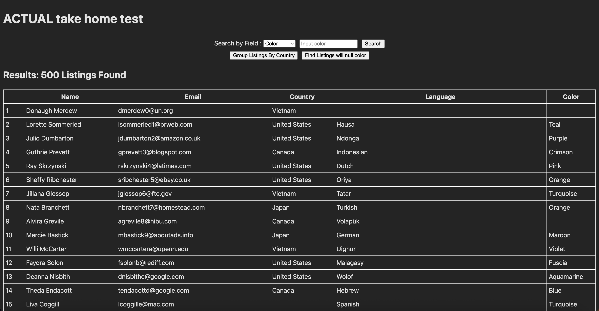
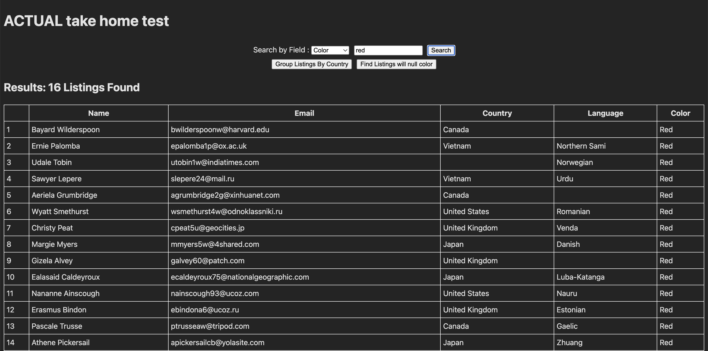
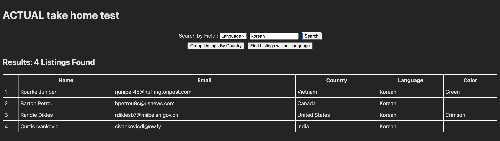
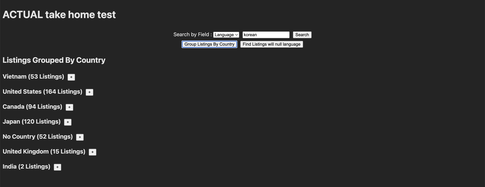
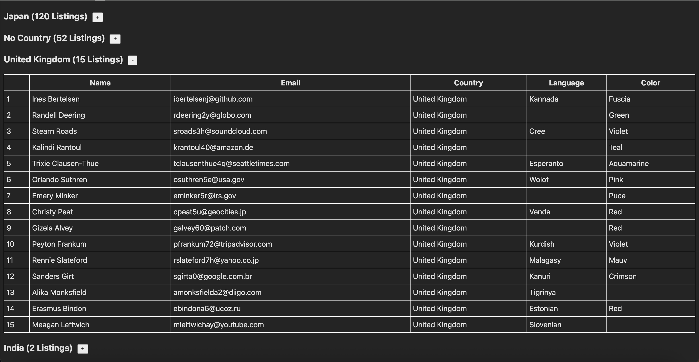
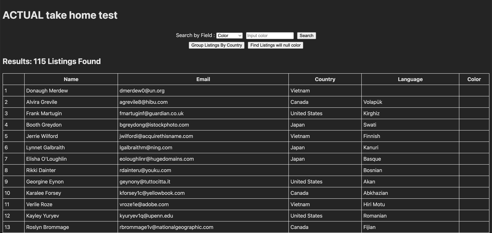
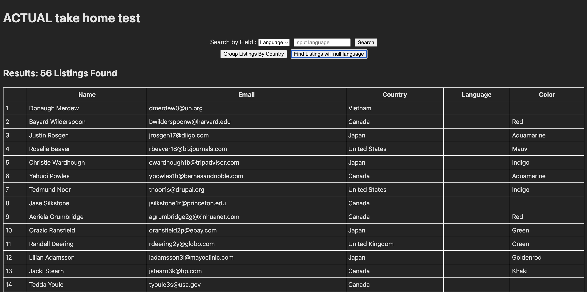

# coding-take-home

## **Initial Screen**
Upon opening the screen, the search options are presented to the user with a table that shows every entry  

## **Searching by color and language**
User is able to toggle between searching by color and language. Results are shown in the table below the search bars  
  

## **Grouping by Country**
By pushing the Group Listings by Country button, the user is presented with mini tables with each listing by country  
  

## **Finding missing information**
By toggling the Search by Field dropdown and pushing the null search button, the user can find listing with missing color or language  
  
